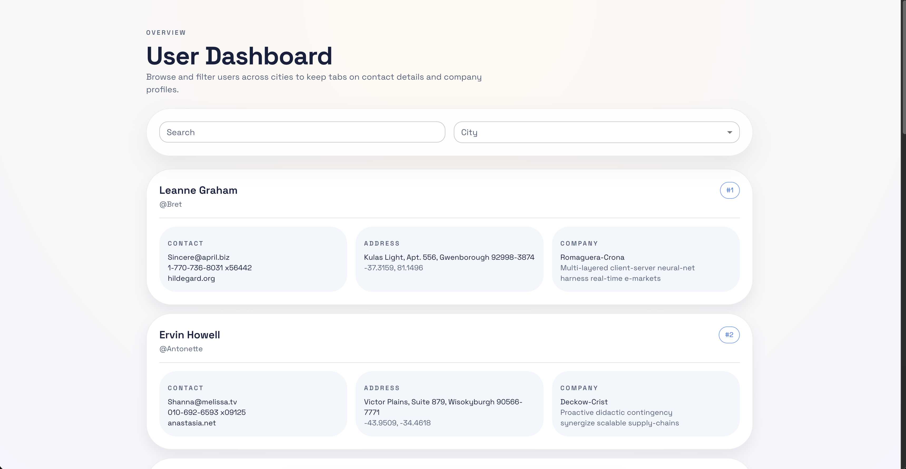

# React Vibe Code Dashboard

This is a 30 minute vibe code result: a clean, responsive user dashboard with search, city filtering, and a card-driven layout.



## Highlights

- User search + city filter
- Responsive layout
- Clean card UI / MUI styling
- TypeScript + Vite stack

## Getting started

```bash
npm install
npm run dev
```
